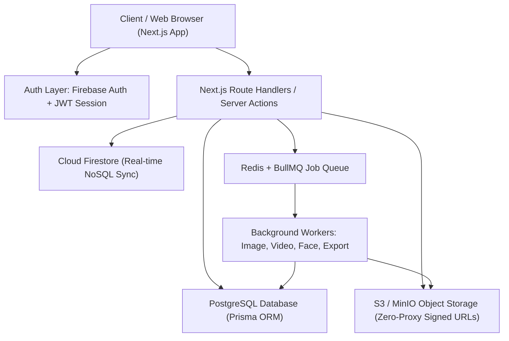

# 🧠 MEDIA SHARE PLATFORM — SYSTEM BRAIN & ARCHITECTURE SPECIFICATION

> **Active Status**: Phase 13 Completed & Approved | Firebase Auth + Cloud Firestore + PostgreSQL Dual Hybrid Architecture Active.
> **Git Tracking**: All future updates must be recorded via Git commits with atomic descriptions.

---

## 📌 1. ARCHITECTURE OVERVIEW

The **Media Share Platform** is an enterprise-grade digital media sharing and event archiving ecosystem designed for educational institutions, corporate organizations, and large events. It supports 500+ concurrent users with zero-proxy binary streaming, granular RBAC, biometric face discovery, and distributed background processing.



---

## 🔐 2. AUTHENTICATION & SECURITY ARCHITECTURE

### Hybrid Auth & Session Management
- **Client Authentication**: Firebase Authentication SDK with Email/Password and 1-Click Google Sign-In (`src/lib/firebase/client.ts`).
- **Session Layer**: Server-signed HMAC-SHA256 JWT tokens stored in secure, `httpOnly` cookies (`AUTH_COOKIE_NAME = 'media_platform_session'`).
- **Session Bridge**: `/api/auth/firebase-sync` seamlessly provisions users between Firebase and PostgreSQL while generating session cookies for SSR and API guards.

### Cloud Firestore Security Rules
```javascript
rules_version = '2';
service cloud.firestore {
  match /databases/{database}/documents {
    
    // User Profiles: Authenticated users can read; only owner can edit
    match /users/{userId} {
      allow read: if request.auth != null;
      allow write: if request.auth != null && request.auth.uid == userId;
    }

    // Organisations & Media: Authenticated users only
    match /{document=**} {
      allow read, write: if request.auth != null;
    }
  }
}
```

---

## 🚀 3. COMPLETED PHASES & CAPABILITIES

| Phase | Description | Key Modules | Status |
|---|---|---|---|
| **Phase 1-2** | Core Next.js Setup, Design System, Multi-tenancy | `src/app/`, `src/components/Navbar.tsx` | ✅ Completed |
| **Phase 3** | Role-Based Access Control (RBAC) & Gate Passwords | `src/server/permissions/`, `src/server/auth/` | ✅ Completed |
| **Phase 4** | S3 / MinIO Object Storage & Direct Upload Presigning | `src/server/storage/`, `src/server/uploads/` | ✅ Completed |
| **Phase 5** | Distributed Background Processing (Sharp + FFmpeg) | `src/server/processing/`, `src/workers/` | ✅ Completed |
| **Phase 6** | CDN Media Delivery with HMAC-SHA256 URL Signing | `src/server/cdn/`, `tests/cdn-tokens.test.ts` | ✅ Completed |
| **Phase 7** | Bulk Uploads & Social Media Team Batch Processing | `src/server/batches/`, `src/server/team/` | ✅ Completed |
| **Phase 8-9** | Event Media Workflows & Moderation Approvals | `src/server/events/`, `src/server/gallery/` | ✅ Completed |
| **Phase 10** | Smart Albums, Tagging & Public/Private Albums | `src/server/albums/`, `tests/albums.test.ts` | ✅ Completed |
| **Phase 11** | Event Lifecycle, Guest Passes & Calendar View | `src/app/organisations/[slug]/calendar/` | ✅ Completed |
| **Phase 12** | Biometric Face Discovery & 128D Embedding Search | `src/server/face/`, `tests/face-discovery-*.test.ts`| ✅ Completed |
| **Phase 13** | Streaming ZIP Bulk Exports & CDN Signed Downloads | `src/server/export/`, `src/components/export/` | ✅ Completed |

---

## 🗄️ 4. DATABASE & INFRASTRUCTURE

### Databases
1. **PostgreSQL (`media_share_platform`)**:
   - Primary relational database managed via Prisma ORM (`prisma/schema.prisma`).
   - Tables: `User`, `Organisation`, `OrganisationMember`, `Event`, `Album`, `Media`, `MediaTeamBatch`, `FaceEmbedding`, `MediaExportJob`, `AuditLog`.
2. **Cloud Firestore (`media-share-website`)**:
   - Secondary real-time document store for rapid client metadata and user documents.

### Storage & CDN
- **Object Storage**: S3-compatible storage (MinIO for local dev, AWS S3 / Cloudflare R2 for production).
- **Direct-to-Storage Architecture**: Files never proxy through Next.js server; client uploads directly via presigned S3 URLs and downloads via HMAC-signed CDN URLs.

---

## 🔄 5. GIT & GITHUB WORKFLOW RULES

Going forward, all changes must adhere to the following Git workflow:
1. **Atomic Commits**: Every major modification, phase completion, or bug fix is committed with structured conventional commit messages:
   - `feat(scope): ...` for new features
   - `fix(scope): ...` for bug fixes
   - `docs(scope): ...` for documentation
   - `refactor(scope): ...` for architectural improvements
2. **Pre-commit Health Check**: `npx tsc --noEmit` and test suites must pass before committing.
3. **Repository Synchronization**: Regular push to remote repository to preserve complete version history.

---

*Last Updated: 2026-08-17 | Maintained by Antigravity AI & Team*
