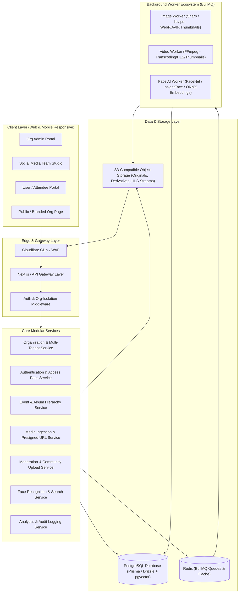
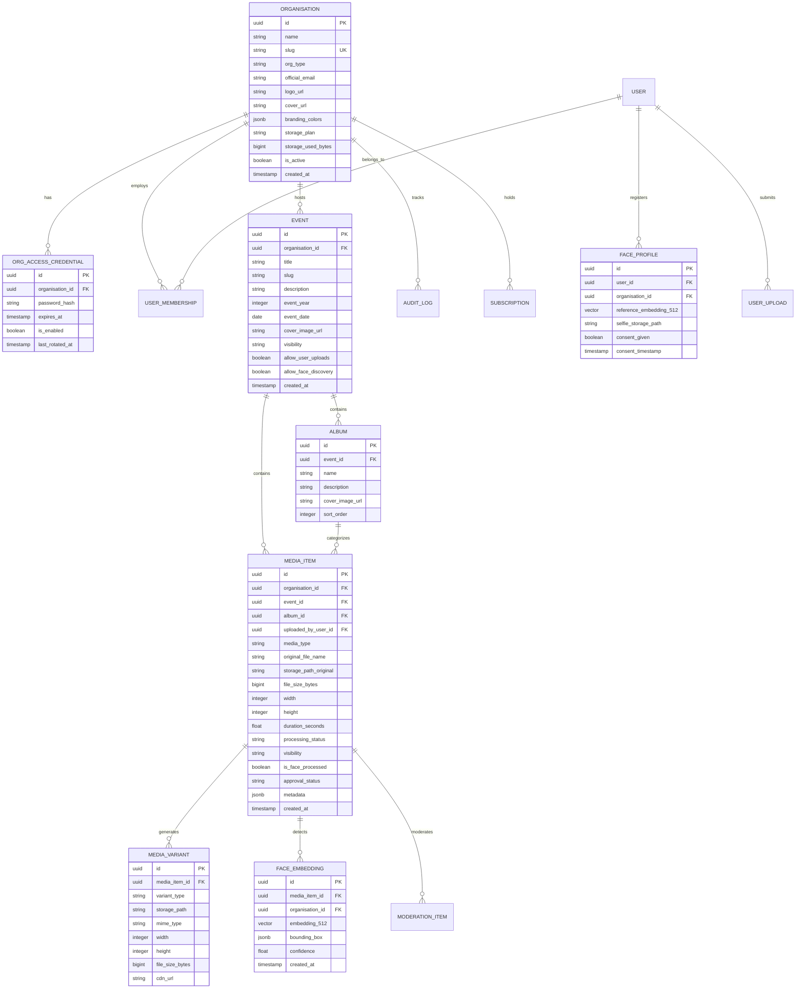

# 🚀 Organisation Event Media & Digital Memories Platform
## Comprehensive Master Architectural Blueprint & Implementation Plan

---

## 1. Executive Summary & Vision

The **Organisation Event Media & Digital Memories Platform** is a production-grade, multi-tenant SaaS platform engineered to centralise, compress, organise, moderate, and securely distribute event photos and videos for educational institutions, corporate enterprises, community clubs, and cultural organisations.

Rather than relying on unorganised Google Drive folders, lossy WhatsApp/Telegram groups, or scattered social media posts, organisations get a dedicated, high-performance, branded digital archive with role-based access control, automated media compression/transcoding, and AI-powered "Find My Photos" facial recognition discovery.

---

## 2. High-Level System Architecture



---

## 3. Technology Stack

| Layer | Recommended Technology | Rationale |
|---|---|---|
| **Frontend Web App** | **Next.js (App Router, TypeScript), Tailwind CSS, Framer Motion, Lucide Icons** | Server-side rendering for public org branding, high interactivity, robust DX. |
| **Backend & API** | **Node.js (TypeScript), Next.js Server Actions / REST API Route Handlers** | Type safety end-to-end, seamless multi-tenant middleware execution. |
| **Database** | **PostgreSQL 16+ with `pgvector` extension** | Relational integrity for multi-tenant data + native vector similarity search for face embeddings. |
| **ORM / Data Access** | **Prisma / Drizzle ORM** | Type-safe migrations, dynamic multi-tenant filtering, fast querying. |
| **Caching & Job Queue** | **Redis (Upstash / Redis 7+) + BullMQ** | High-throughput asynchronous background job management for media processing. |
| **Object Storage** | **AWS S3 / Cloudflare R2 / MinIO** | S3-compatible, cost-effective storage with presigned URL direct upload capability. |
| **Image Processing** | **Sharp (libvips)** | Ultra-fast image resizing, WebP/AVIF compression, thumbnail generation. |
| **Video Transcoding** | **FFmpeg (fluent-ffmpeg)** | Multi-bitrate HLS encoding (1080p, 720p, 480p), adaptive compression, poster extraction. |
| **Face Recognition Engine**| **InsightFace / FaceNet ONNX Runtime / `pgvector`** | 512-dimension face embeddings with cosine similarity distance search (`<=>`). |
| **CDN & Delivery** | **Cloudflare CDN + Signed URLs** | Global edge caching, low-latency streaming, hotlink prevention. |

---

## 4. Multi-Tenant Security & Isolation Model

### 4.1 Tenant Isolation Strategy
* **Shared Database with Discriminator (`org_id`)**: Every table containing tenant data enforces an indexed `organisation_id` foreign key.
* **Middleware Interception**: All incoming API requests validate tenant context through URL slug (`/org/:slug`), request header (`X-Org-ID`), or JWT token claims.
* **Row-Level Authorization Guard**: Data access layer injects mandatory `where: { organisationId }` constraints on every query to eliminate cross-tenant data leakage.

### 4.2 Multi-Tier Authentication Architecture
1. **Platform Super Admin**: Full visibility over all tenants, storage quotas, platform subscriptions, and global moderation.
2. **Organisation Administrator**: Controls organisation configuration, event hierarchies, team credentials, access codes, and moderation.
3. **Social Media Team Accounts**: Individual authenticated accounts with event creation, bulk uploading, album publishing, and tagging privileges. All mutations produce immutable audit log entries.
4. **Organisation Access Password & User Session**:
   - Organisation Access Password is hashed using **Argon2id/Bcrypt**.
   - Normal users/students unlock the organisation portal by validating the Access Password.
   - Successful unlock issues an encrypted scoped session ticket (`OrgAccessJWT`), allowing access to approved events.
5. **Attendee / Student Accounts**: Optional authenticated account linked to student profile for bookmarking, submitting user-uploaded photos, and registering biometric face profiles for "Find My Photos".

---

## 5. Core Data Model & Database Architecture



---

## 6. End-to-End Media Ingestion & Processing Pipeline

### 6.1 Direct Presigned Bulk Upload Workflow
1. **Initiate Upload Batch**: Client requests presigned S3/R2 multi-part upload URLs for $N$ files from the API.
2. **Direct-to-S3 Upload**: Browser uploads binary chunks directly to Object Storage, preventing API server memory bottlenecks.
3. **Completion Webhook**: Client notifies the API of upload completion; DB creates `MEDIA_ITEM` records with status `PENDING_PROCESSING`.
4. **BullMQ Dispatch**: Jobs are enqueued to `image-processing-queue`, `video-processing-queue`, and `face-detection-queue`.

### 6.2 Photo Compression & Optimization Worker
* **Input**: Original image binary from S3.
* **Processing**:
  - EXIF orientation correction and metadata extraction.
  - Generates **Thumbnail** (400px width, WebP/AVIF, quality 80).
  - Generates **Web Optimized Display** (1920px max width, WebP/AVIF, smart chroma subsampling, quality 82).
  - Generates **High-Res Archive** variant.
* **Storage**: Uploads derivatives to S3 and updates `MEDIA_VARIANT` table with CDN URLs.

### 6.3 Video Transcoding & HLS Streaming Worker
* **Input**: Original video file (MP4/MOV/MKV up to 4K).
* **Processing**:
  - Extracts poster thumbnail at 1s timestamp.
  - Multi-rate transcode using FFmpeg (`libx264` / `libvpx-vp9` with CRF rate control):
    - `1080p` (Full HD, 4500k bitrate, AAC 128k audio)
    - `720p` (HD, 2500k bitrate, AAC 128k audio)
    - `480p` (SD, 1000k bitrate, AAC 96k audio)
  - Generates HLS Master Playlist (`.m3u8`) and `.ts` chunk segments for dynamic adaptive bitrate streaming.
* **Storage**: Saves HLS segments to S3 and updates variant records.

### 6.4 AI Face Recognition & "Find My Photos" Pipeline
1. **Biometric Consent**: User reviews clear biometric consent terms and captures a live selfie.
2. **Feature Extraction**: Face recognition worker detects bounding box coordinates, aligns facial landmarks, and computes a 512-dimensional normalized embedding vector.
3. **Vector Indexing**: Stored in PostgreSQL using `pgvector` with HNSW (Hierarchical Navigable Small World) index for sub-millisecond retrieval.
4. **1:N Face Search Query**:
   ```sql
   SELECT m.*, (f.embedding_512 <=> :user_selfie_vector) AS cosine_distance
   FROM face_embeddings f
   JOIN media_items m ON f.media_item_id = m.id
   WHERE m.organisation_id = :org_id
     AND m.event_id = :event_id
     AND m.approval_status = 'APPROVED'
     AND (f.embedding_512 <=> :user_selfie_vector) < 0.42
   ORDER BY cosine_distance ASC
   LIMIT 100;
   ```
5. **Result Presentation**: Instant, paginated gallery displaying only photos where the user appears, filtered strictly within authorized event scopes.

---

## 7. Moderation, Workflow & Digital Archive Engine

### 7.1 Community Upload & Moderation Lifecycle
* Attendees upload photos with flags `PUBLIC` or `FACE_ONLY`.
* Content enters the **Admin Moderation Queue** in `PENDING` state.
* Org Admins & Social Media Team leaders can:
  - Batch approve, batch reject, quarantine, or soft-delete.
  - Preview full-res media with EXIF metadata inspection.
* Only `APPROVED` media transitions to public visibility in the main gallery.

### 7.2 Digital Archive Explorer
* Hierarchical drill-down: `Year (e.g. 2026)` $\rightarrow$ `Event (e.g. Annual Cultural Fest)` $\rightarrow$ `Albums (Cultural, Sports, Audience, BTS)` $\rightarrow$ `Media Grid`.
* Real-time faceted search: Search by Keywords, Year, Date Range, Album, Media Type (Photo/Video), Tags, and Face Matching.

---

## 8. Modular Implementation Roadmap

This roadmap is designed for incremental execution when you provide implementation prompts one by one:

```text
┌─────────────────────────────────────────────────────────────────────────────┐
│                       MODULAR IMPLEMENTATION PHASES                         │
├─────────┬───────────────────────────────────┬───────────────────────────────┤
│ Phase   │ Focus Area                        │ Deliverables                  │
├─────────┼───────────────────────────────────┼───────────────────────────────┤
│ Phase 1 │ Core Infrastructure & Database    │ Next.js + TS + Tailwind init, │
│         │                                   │ PostgreSQL Schema & Migrations│
├─────────┼───────────────────────────────────┼───────────────────────────────┤
│ Phase 2 │ Multi-Tenant Auth & Org Portal    │ Org Registration, Subdomains, │
│         │                                   │ Org Access Pass System, RBAC  │
├─────────┼───────────────────────────────────┼───────────────────────────────┤
│ Phase 3 │ Event & Album Management Core     │ Year-wise Event CRUD, Albums, │
│         │                                   │ Permissions & Cover Management│
├─────────┼───────────────────────────────────┼───────────────────────────────┤
│ Phase 4 │ Ingestion Engine & Storage Setup  │ S3 / R2 Presigned Uploads,    │
│         │                                   │ Resumable Chunks, Upload Queue│
├─────────┼───────────────────────────────────┼───────────────────────────────┤
│ Phase 5 │ Media Workers (Image & Video)     │ Sharp Image Processing,       │
│         │                                   │ FFmpeg Video Transcoding & HLS│
├─────────┼───────────────────────────────────┼───────────────────────────────┤
│ Phase 6 │ Rich Galleries & Bulk Uploader    │ Masonry Gallery, Lightbox,    │
│         │                                   │ 500+ File Bulk Upload Matrix  │
├─────────┼───────────────────────────────────┼───────────────────────────────┤
│ Phase 7 │ Community Uploads & Moderation    │ Public/Face Flags, Moderation │
│         │                                   │ Dashboard, Batch Actions      │
├─────────┼───────────────────────────────────┼───────────────────────────────┤
│ Phase 8 │ AI Face Engine (Find My Photos)   │ Biometric Consent, FaceNet/   │
│         │                                   │ pgvector Similarity Search    │
├─────────┼───────────────────────────────────┼───────────────────────────────┤
│ Phase 9 │ Archive Search, Analytics & Audit │ Faceted Search, Storage Meter,│
│         │                                   │ Immutable Audit Logs, Branding│
├─────────┼───────────────────────────────────┼───────────────────────────────┤
│ Phase 10│ SaaS Subscriptions, Polish & Ops  │ Tier Limits, Docker Compose,  │
│         │                                   │ Production CI/CD & CDN Tuning │
└─────────┴───────────────────────────────────┴───────────────────────────────┘
```

---

## 9. Current Status & Next Action

- **Git Repository Initialized**: Connected to `https://github.com/bhagyabratagantayat/Media-Share-Platform.git` on `main` branch.
- **Architectural Plan Documented**: Ready for step-by-step modular code implementation.
- **Awaiting User Instruction**: Standby for Phase 1 / Step 1 implementation prompt.
