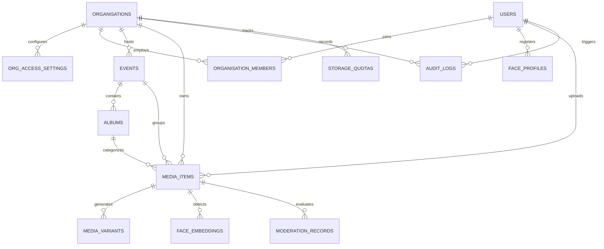

# Database Audit & Data Model Specification

**Project:** Organisation Event Media & Digital Memories Platform  
**Phase:** Phase 0 — Project Audit & Production Foundation  
**Database Engine:** PostgreSQL 16+ with `pgvector` extension  
**File:** `docs/DATABASE_AUDIT.md`  

---

## 1. Database State Assessment

- **Current Repository Database State**: Clean baseline. No legacy tables or outdated schema migrations exist.
- **Migration Strategy**: Zero destructive migrations required. The relational and vector schema can be constructed following clean, production-grade domain-driven models from Phase 1 onward.
- **Binary Data Policy**: **Zero binary media storage in PostgreSQL**. PostgreSQL is reserved strictly for structured metadata, relational mappings, audit logs, and 512-dimension face embedding vectors.

---

## 2. Target Production Database Schema & Entity Relationships



---

## 3. Detailed Entity Schema Specifications

### 3.1 Organisation & Multi-Tenancy Tables

#### `organisations`
| Column | Type | Constraints | Description |
|---|---|---|---|
| `id` | `UUID` | `PRIMARY KEY DEFAULT gen_random_uuid()` | Unique organisation identifier |
| `name` | `VARCHAR(255)` | `NOT NULL` | Full organisation name |
| `slug` | `VARCHAR(100)` | `UNIQUE NOT NULL` | URL-safe slug (e.g., `bec-bhubaneswar`) |
| `org_type` | `VARCHAR(50)` | `NOT NULL` | `COLLEGE`, `UNIVERSITY`, `COMPANY`, `CLUB`, etc. |
| `official_email` | `VARCHAR(255)` | `NOT NULL` | Primary administrative contact email |
| `contact_phone` | `VARCHAR(50)` | `NULL` | Organisation phone number |
| `logo_url` | `TEXT` | `NULL` | Public CDN logo URL |
| `cover_url` | `TEXT` | `NULL` | Public CDN banner URL |
| `branding_theme` | `JSONB` | `DEFAULT '{}'` | Primary/secondary colours, dark mode preferences |
| `is_active` | `BOOLEAN` | `DEFAULT TRUE NOT NULL` | Account status flag |
| `created_at` | `TIMESTAMPTZ` | `DEFAULT NOW() NOT NULL` | Creation timestamp |
| `updated_at` | `TIMESTAMPTZ` | `DEFAULT NOW() NOT NULL` | Last update timestamp |

#### `org_access_settings`
| Column | Type | Constraints | Description |
|---|---|---|---|
| `id` | `UUID` | `PRIMARY KEY DEFAULT gen_random_uuid()` | Unique setting identifier |
| `organisation_id` | `UUID` | `UNIQUE NOT NULL REFERENCES organisations(id) ON DELETE CASCADE` | Associated tenant |
| `access_password_hash` | `TEXT` | `NOT NULL` | Argon2id hash of organisation access password |
| `is_password_enabled` | `BOOLEAN` | `DEFAULT TRUE NOT NULL` | Enables/disables shared access gate |
| `password_expires_at` | `TIMESTAMPTZ` | `NULL` | Automatic password expiration date |
| `last_rotated_at` | `TIMESTAMPTZ` | `DEFAULT NOW() NOT NULL` | Timestamp when password was last changed |

---

### 3.2 User & Role Management Tables

#### `users`
| Column | Type | Constraints | Description |
|---|---|---|---|
| `id` | `UUID` | `PRIMARY KEY DEFAULT gen_random_uuid()` | Unique user identifier |
| `email` | `VARCHAR(255)` | `UNIQUE NOT NULL` | User email address |
| `password_hash` | `TEXT` | `NOT NULL` | Argon2id / Bcrypt password hash |
| `full_name` | `VARCHAR(255)` | `NOT NULL` | User's full name |
| `avatar_url` | `TEXT` | `NULL` | Profile photo CDN URL |
| `is_platform_admin` | `BOOLEAN` | `DEFAULT FALSE NOT NULL` | SuperAdmin status |
| `email_verified_at` | `TIMESTAMPTZ` | `NULL` | Verification timestamp |
| `created_at` | `TIMESTAMPTZ` | `DEFAULT NOW() NOT NULL` | Creation timestamp |
| `updated_at` | `TIMESTAMPTZ` | `DEFAULT NOW() NOT NULL` | Last update timestamp |

#### `organisation_members`
| Column | Type | Constraints | Description |
|---|---|---|---|
| `id` | `UUID` | `PRIMARY KEY DEFAULT gen_random_uuid()` | Unique membership record ID |
| `organisation_id` | `UUID` | `NOT NULL REFERENCES organisations(id) ON DELETE CASCADE` | Associated tenant |
| `user_id` | `UUID` | `NOT NULL REFERENCES users(id) ON DELETE CASCADE` | Associated user |
| `role` | `VARCHAR(50)` | `NOT NULL` | `ORGANISATION_OWNER`, `ORGANISATION_ADMIN`, `SOCIAL_MEDIA_MANAGER`, `SOCIAL_MEDIA_MEMBER`, `MODERATOR`, `USER` |
| `permissions` | `JSONB` | `DEFAULT '[]'` | Granular permission overrides |
| `joined_at` | `TIMESTAMPTZ` | `DEFAULT NOW() NOT NULL` | Timestamp joined |

---

### 3.3 Event & Album Hierarchy Tables

#### `events`
| Column | Type | Constraints | Description |
|---|---|---|---|
| `id` | `UUID` | `PRIMARY KEY DEFAULT gen_random_uuid()` | Unique event identifier |
| `organisation_id` | `UUID` | `NOT NULL REFERENCES organisations(id) ON DELETE CASCADE` | Associated tenant |
| `name` | `VARCHAR(255)` | `NOT NULL` | Event title (e.g. `Independence Day 2026`) |
| `slug` | `VARCHAR(100)` | `NOT NULL` | URL-safe slug |
| `description` | `TEXT` | `NULL` | Detailed event description |
| `event_year` | `INTEGER` | `NOT NULL` | Archive year index (e.g. 2026) |
| `event_date` | `DATE` | `NOT NULL` | Date of event |
| `location` | `VARCHAR(255)` | `NULL` | Physical venue |
| `cover_media_id` | `UUID` | `NULL` | Media ID of cover image |
| `visibility` | `VARCHAR(30)` | `DEFAULT 'PUBLIC' NOT NULL` | `PUBLIC`, `ORG_ONLY`, `PRIVATE` |
| `allow_user_uploads` | `BOOLEAN` | `DEFAULT TRUE NOT NULL` | Allows attendee community uploads |
| `allow_downloads` | `BOOLEAN` | `DEFAULT TRUE NOT NULL` | Allows visitors to download original/variants |
| `face_search_enabled`| `BOOLEAN` | `DEFAULT TRUE NOT NULL` | Enables facial search in this event |
| `created_by` | `UUID` | `NOT NULL REFERENCES users(id)` | Creator user ID |
| `created_at` | `TIMESTAMPTZ` | `DEFAULT NOW() NOT NULL` | Creation timestamp |
| `updated_at` | `TIMESTAMPTZ` | `DEFAULT NOW() NOT NULL` | Last update timestamp |

#### `albums`
| Column | Type | Constraints | Description |
|---|---|---|---|
| `id` | `UUID` | `PRIMARY KEY DEFAULT gen_random_uuid()` | Unique album identifier |
| `organisation_id` | `UUID` | `NOT NULL REFERENCES organisations(id) ON DELETE CASCADE` | Associated tenant |
| `event_id` | `UUID` | `NOT NULL REFERENCES events(id) ON DELETE CASCADE` | Parent event |
| `name` | `VARCHAR(255)` | `NOT NULL` | Album name (e.g. `Cultural Program`, `Audience`) |
| `description` | `TEXT` | `NULL` | Album description |
| `cover_media_id` | `UUID` | `NULL` | Album thumbnail |
| `sort_order` | `INTEGER` | `DEFAULT 0 NOT NULL` | Display sequence order |
| `created_at` | `TIMESTAMPTZ` | `DEFAULT NOW() NOT NULL` | Creation timestamp |

---

### 3.4 Media Metadata & Derivatives Tables

#### `media_items`
| Column | Type | Constraints | Description |
|---|---|---|---|
| `id` | `UUID` | `PRIMARY KEY DEFAULT gen_random_uuid()` | Unique media identifier |
| `organisation_id` | `UUID` | `NOT NULL REFERENCES organisations(id) ON DELETE CASCADE` | Associated tenant |
| `event_id` | `UUID` | `NOT NULL REFERENCES events(id) ON DELETE CASCADE` | Parent event |
| `album_id` | `UUID` | `NULL REFERENCES albums(id) ON DELETE SET NULL` | Parent album |
| `uploader_id` | `UUID` | `NOT NULL REFERENCES users(id)` | Uploader user ID |
| `media_type` | `VARCHAR(20)` | `NOT NULL` | `IMAGE` or `VIDEO` |
| `original_file_name` | `VARCHAR(255)` | `NOT NULL` | Original filename |
| `original_storage_key`| `TEXT` | `NOT NULL` | Path in S3 bucket (`originals/...`) |
| `mime_type` | `VARCHAR(100)` | `NOT NULL` | MIME type (e.g., `image/jpeg`, `video/mp4`) |
| `original_size_bytes`| `BIGINT` | `NOT NULL` | Raw file size in bytes |
| `width` | `INTEGER` | `NULL` | Resolution width |
| `height` | `INTEGER` | `NULL` | Resolution height |
| `duration_seconds` | `FLOAT` | `NULL` | Video duration (seconds) |
| `processing_status` | `VARCHAR(30)` | `DEFAULT 'PENDING' NOT NULL` | `PENDING`, `PROCESSING`, `COMPLETED`, `FAILED` |
| `approval_status` | `VARCHAR(30)` | `DEFAULT 'APPROVED' NOT NULL` | `PENDING_APPROVAL`, `APPROVED`, `REJECTED` |
| `visibility` | `VARCHAR(30)` | `DEFAULT 'PUBLIC' NOT NULL` | `PUBLIC`, `FACE_ONLY`, `PRIVATE` |
| `face_search_enabled`| `BOOLEAN` | `DEFAULT TRUE NOT NULL` | Allowed for facial search |
| `metadata` | `JSONB` | `DEFAULT '{}'` | EXIF (camera, lens, ISO, timestamp) |
| `created_at` | `TIMESTAMPTZ` | `DEFAULT NOW() NOT NULL` | Creation timestamp |
| `updated_at` | `TIMESTAMPTZ` | `DEFAULT NOW() NOT NULL` | Last update timestamp |

#### `media_variants`
| Column | Type | Constraints | Description |
|---|---|---|---|
| `id` | `UUID` | `PRIMARY KEY DEFAULT gen_random_uuid()` | Unique derivative ID |
| `media_item_id` | `UUID` | `NOT NULL REFERENCES media_items(id) ON DELETE CASCADE` | Parent media item |
| `variant_type` | `VARCHAR(50)` | `NOT NULL` | `THUMBNAIL_WEBP`, `DISPLAY_1080P_WEBP`, `HLS_STREAM_MASTER`, `PREVIEW_MP4` |
| `storage_key` | `TEXT` | `NOT NULL` | Path in S3 derivative bucket |
| `mime_type` | `VARCHAR(100)` | `NOT NULL` | Variant MIME format |
| `file_size_bytes` | `BIGINT` | `NOT NULL` | Compressed variant byte size |
| `width` | `INTEGER` | `NULL` | Derivative width |
| `height` | `INTEGER` | `NULL` | Derivative height |
| `cdn_url` | `TEXT` | `NOT NULL` | Cached delivery CDN endpoint |
| `created_at` | `TIMESTAMPTZ` | `DEFAULT NOW() NOT NULL` | Timestamp created |

---

### 3.5 Biometric Facial Recognition Tables (`pgvector`)

#### `face_embeddings`
| Column | Type | Constraints | Description |
|---|---|---|---|
| `id` | `UUID` | `PRIMARY KEY DEFAULT gen_random_uuid()` | Unique face detection ID |
| `organisation_id` | `UUID` | `NOT NULL REFERENCES organisations(id) ON DELETE CASCADE` | Associated tenant |
| `media_item_id` | `UUID` | `NOT NULL REFERENCES media_items(id) ON DELETE CASCADE` | Source media item |
| `embedding_512` | `vector(512)` | `NOT NULL` | 512-dimension float vector representation |
| `bounding_box` | `JSONB` | `NOT NULL` | Normalized `{x, y, width, height}` face coords |
| `confidence` | `FLOAT` | `NOT NULL` | Detection confidence score (0.0 to 1.0) |
| `created_at` | `TIMESTAMPTZ` | `DEFAULT NOW() NOT NULL` | Creation timestamp |

#### `face_profiles`
| Column | Type | Constraints | Description |
|---|---|---|---|
| `id` | `UUID` | `PRIMARY KEY DEFAULT gen_random_uuid()` | Profile ID |
| `user_id` | `UUID` | `NOT NULL REFERENCES users(id) ON DELETE CASCADE` | Associated user |
| `organisation_id` | `UUID` | `NOT NULL REFERENCES organisations(id) ON DELETE CASCADE` | Associated tenant |
| `reference_embedding`| `vector(512)` | `NOT NULL` | Reference selfie embedding |
| `consent_given` | `BOOLEAN` | `DEFAULT FALSE NOT NULL` | Biometric consent flag |
| `consent_timestamp` | `TIMESTAMPTZ` | `DEFAULT NOW() NOT NULL` | Explicit consent timestamp |
| `updated_at` | `TIMESTAMPTZ` | `DEFAULT NOW() NOT NULL` | Last selfie update |

---

## 4. Indexing Strategy & Performance Optimization

To guarantee sub-50ms query response times under 500+ concurrent active users, the following indexes are mandatory:

```sql
-- 1. Multi-Tenant Event & Media Filtering
CREATE INDEX idx_events_org_date ON events (organisation_id, event_date DESC);
CREATE INDEX idx_events_org_slug ON events (organisation_id, slug);
CREATE INDEX idx_media_org_event ON media_items (organisation_id, event_id, created_at DESC);
CREATE INDEX idx_media_album ON media_items (album_id) WHERE album_id IS NOT NULL;
CREATE INDEX idx_media_status_visibility ON media_items (organisation_id, approval_status, visibility);

-- 2. Organisation Membership Lookups
CREATE UNIQUE INDEX idx_unique_org_user ON organisation_members (user_id, organisation_id);
CREATE INDEX idx_org_members_role ON organisation_members (organisation_id, role);

-- 3. Media Derivatives Lookup
CREATE INDEX idx_variants_media_item ON media_variants (media_item_id, variant_type);

-- 4. HNSW Vector Index for High-Speed Face Search (Cosine Similarity)
CREATE INDEX idx_face_embeddings_hnsw ON face_embeddings 
USING hnsw (embedding_512 vector_cosine_ops)
WITH (m = 16, ef_construction = 64);
```

---

## 5. Scalability & Connection Management

1. **Connection Pooling**: PostgreSQL connection pool configured via PgBouncer with maximum pool size aligned with server concurrency limits (e.g. 50 pooled connections per API node).
2. **Cursor Pagination**: All gallery endpoints will use cursor-based pagination (`WHERE id < :cursor_id ORDER BY created_at DESC LIMIT 50`) to eliminate severe `OFFSET` degradation on 100,000+ photo archives.
3. **Read Isolation**: Read queries for public events and media utilize read replicas or Redis cache layers, protecting write transactions.
